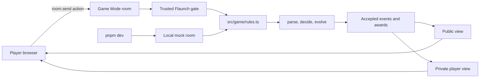
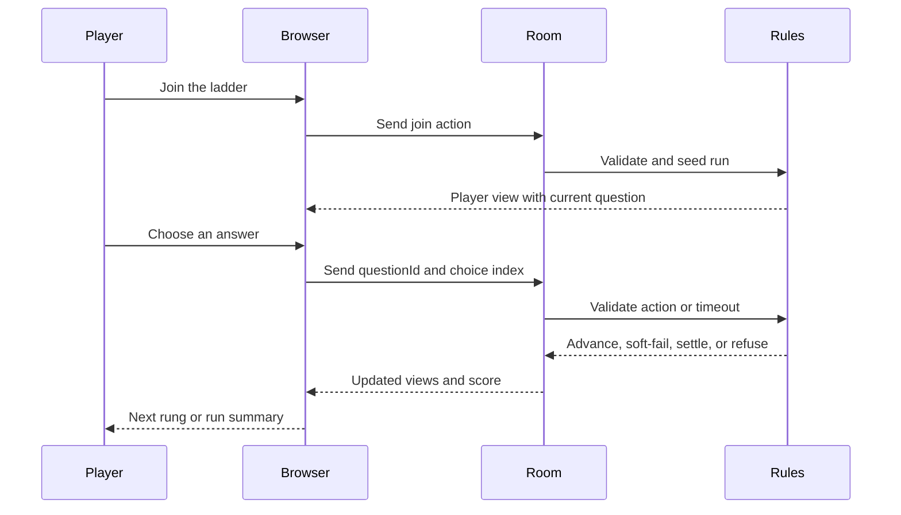

# Speedrun Trivia Ladder

A knowledge-based launch gate for the Flaunch ecosystem and Game Mode. Players climb 10 timed trivia rungs about a project, earning points and a launch allowance through informed participation rather than raw reflexes.

**Live demo:** https://speedrun-trivia-ladder.vercel.app/

**References:** [Flaunch](https://flaunch.gg/) | [Game Mode SDK](https://github.com/flayerlabs/gamemode-sdk) | [Game Mode spec](https://github.com/flayerlabs/gamemode-spec)

## Why it exists

Most game-based launch gates reward latency, reaction time, or hardware advantage. Speedrun Trivia Ladder explores a different gate: reward the community member who has read the docs, followed the roadmap, remembers the project story, and understands what they are participating in.

The game is designed as a reusable Flaunch Game Mode, not a browser-only quiz. It combines escalating knowledge checks with time pressure, soft failures, replayable scoring, and a server-authoritative rules model.

## How it works

The ladder has three difficulty tiers:

- **Warm-up:** rungs 1-4, 8-second question budget
- **Climb:** rungs 5-8, 7-second question budget
- **Summit:** rungs 9-10, 6-second question budget

Correct answers award tier points plus a capped speed bonus. A wrong answer or timeout drops the effective tier value, but the run continues. Reaching the summit earns the completion bonus. Only the best run counts, so replaying weak attempts cannot stack allowance.

## Architecture



The browser proposes actions and renders views. The rules module decides validity, scoring, progression, timing, answer checks, secrecy, and rewards. The answer key is never part of the public view, and the client cannot submit a score.

Flaunch provides the live Game Mode execution layer; this project does not operate a separate application server. The rules are pure deterministic TypeScript so accepted events can be stored and command sequences can be replayed consistently. Wallets, private keys, RPC calls, transaction construction, and launch authorization remain outside the game code.

## Gameplay flow



## Fairness and trust

- Scores are derived from raw answer actions inside `decide()`; clients never submit points.
- Public views contain leaderboard and round state, but not the correct answer.
- `playerView()` exposes only the current question and choices for that player.
- Per-player seeded shuffling prevents a fixed option-order cheat sheet from transferring between players.
- Timers use authoritative command timestamps and server wake events.
- Replays are deterministic, and only the highest single run contributes allowance.
- `rewardBounds()` declares the maximum possible score to the platform.

## Creator packs

[src/creator.ts](src/creator.ts) provides local authoring, tier-depth checks, and preview support. A creator can write project-specific questions without changing the rules engine. See [CUSTOM_PACK_GUIDE.md](CUSTOM_PACK_GUIDE.md) for the pack schema and the security boundary.

Public answer-bearing pack URLs are intentionally disabled. A pack containing `correct` values must be loaded and validated by a trusted gate or server-side configuration process; it must never be exposed as a public browser-fetchable JSON file.

## Getting started

Requirements: Node.js and pnpm.

```bash
pnpm install
pnpm dev
```

Open the local Vite URL to play. The development build uses the real rules in a local mock room and needs no chain, wallet, or custom server.

Run the verification commands in another terminal:

```bash
pnpm test
pnpm typecheck
pnpm build
```

`pnpm test` runs the purity check and Vitest suite. `pnpm build` creates the deployable static bundle in `dist/`, including the play, creator, and preview entry pages.

## Project layout

```text
.
├── src/
│   ├── game/
│   │   ├── packs/
│   │   │   └── demo.ts          # bundled 25-question sample pack
│   │   └── rules.ts             # authoritative state, scoring, timing, and views
│   ├── creator.ts                # local pack authoring and validation UI
│   └── play.ts                   # player UI, room subscriptions, and actions
├── test/
│   └── rules.test.ts             # scoring, replay, secrecy, and anti-grind tests
├── index.html                    # main play experience
├── creator.html                  # creator authoring experience
├── preview.html                  # local preview experience
├── CUSTOM_PACK_GUIDE.md          # custom pack schema and security guidance
├── docs/
│   ├── SUBMISSION_GUIDE.md       # packaging and upload notes
│   └── SUBMISSION_CHECKLIST.md   # readiness evidence and verification checklist
├── package.json                  # scripts and SDK dependencies
├── vite.config.ts                # Vite build configuration
└── tsconfig.json                 # TypeScript configuration
```

## Flaunch submission

- **Track:** Knowledge
- **Name:** Speedrun Trivia Ladder
- **Source:** this repository and its [authoritative rules](src/game/rules.ts)
- **Demo:** https://speedrun-trivia-ladder.vercel.app/
- **Packaging notes:** [docs/SUBMISSION_GUIDE.md](docs/SUBMISSION_GUIDE.md)
- **Readiness evidence:** [docs/SUBMISSION_CHECKLIST.md](docs/SUBMISSION_CHECKLIST.md)

The repository includes a local mock-room integration. It does not include a live gate harness; a production connection should follow the official [Flaunch live-gate guide](https://github.com/flayerlabs/gamemode-sdk/blob/main/docs/guides/run-a-gate.md) rather than introducing a second protocol.

## Acknowledgments

Built for the Flaunch Game Mode ecosystem and its Knowledge track. Thanks to the Flaunch team, SDK authors, and playtesters whose feedback shaped the rules, fairness model, and creator workflow.
